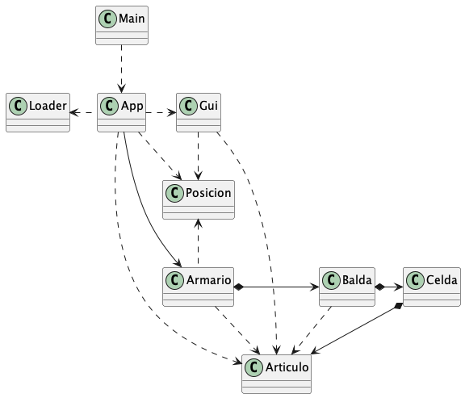

<!-- Based on the Best-README-Template. -->

<h1 align="center">Proyecto UT4   (para hacer en casa individualmente)</h1>

---
<!-- TABLE OF CONTENTS -->

  
Índice

  <ol>
    <li>
      <a href="#Objetivos">Objetivos</a>
    </li>
    <li>
      <a href="#Antes-de-empezar">Antes de empezar</a>
    </li>
    <li>
      <a href="#Especificaciones">Especificaciones</a>
    </li>
    <li>
      <a href="#Clases-Loader-y-Gui">Clases Loader y Gui</a>
    </li>
    <li>
      <a href="#Clase-App">Clase App</a>
    </li>
    <li>
      <a href="#Modelo-de-datos">Modelo de datos</a>
    </li>
    <li>
      <a href="#La-aplicación">La aplicación</a>
    </li>
  </ol>

---
<h2 id="Objetivos">Objetivos</h2>

Saber:  
- definir objetos que contienen otros objetos
- definir constructores sobrecargados
- crear objetos a través del operador new
- definir y utilizar parámetros y valores de retorno que sean tipos objetos
- realizar llamadas externas (paso de mensajes entre objetos)
- realizar llamadas internas
- utilizar correctamente this y null
- formatear valores con String.format
- generar valores aleatorios con la clase Random

Repasar:  
- toString( )
- estructuras condicionales: if / switch

(<a href="#readme-top">volver al inicio</a>)

<h2 id="Antes-de-empezar">Antes de empezar</h2>

- Este ejercicio es para realizar de forma **individual** en casa. 
- El proyecto de partida está en https://github.com/aetxabao/Armario
- Deberás crear un repositorio privado a partir de este código. (Consultar cómo hacerlo en Moodle)
- Haz commits periódicamente y push cada día que trabajes al menos una vez
- Recuerda hacer push del último commit a GitHub antes del fin de la fecha de entrega
- La fecha tope de entrega es el **Jueves 30 de Noviembre** hasta las 23,59 h. 
- Se anulará automáticamente la corrección del ejercicio y se evaluará con un 0 si se detecta que ha 	sido copiado o dejado copiar a algún compañero/a 
- **El profesorado podrá convocar al alumno/a para defender oralmente el proyecto**

(<a href="#readme-top">volver al inicio</a>)

<h2 id="Especificaciones">Especificaciones</h2>

Este trabajo se debe realizar sin utilizar arrays, listas, ni otras colecciones del API de Java. Sólo se pueden utilizar las clases que se mencionan en el propio enunciado. El trabajo versa sobre un armario con una estructura que vamos a definir mediante unas clases que vamos a crear. En este armario se podrán almacenar artículos de la forma que se explica a continuación.

La aplicación tiene una referencia a una instancia de Armario como atributo que se debe instanciar en el método constructor de App. Esta clase tiene un método público run que ejecuta en bucle mostrar el menú, leer la opción que se desee realizar y ejecutarla hasta que se desee salir del programa. Para ello principalmente se utiliza los métodos estáticos de las clases Loader y Gui y los métodos públicos de la clase Armario.

Un armario tendrá cuatro baldas y las baldas cinco celdas en las que se pueden guardar hasta cuatro artículos. Es decir,  se puede entender el armario como una matriz de 4 filas y 5 columnas y en cada una de estas celdas se pueden guardar hasta 4 artículos. La capacidad máxima del armario es de 4 x 5 x 4 = 80 artículos. Pero inicialmente, el armario estará vació, en las celdas no habrá ningún artículo.

(<a href="#readme-top">volver al inicio</a>)

<h2 id="Clases-Loader-y-Gui">Clases Loader y Gui</h2>

La clase Loader permite cargar un conjunto de valores aleatorios en el armario que se pase como parámetro. Estudia el código de esta clase. Aunque todos sus métodos son estáticos la clase tiene dos atributos. Por qué aunque el número de artículos inicial que hay que cargar en el armario es 50 resulta que al final no hay ese número de artículos al finalizar el método cargarDatos?

La clase Gui, abreviatura de Graphic User Interface, permite mostrar el menú y leer distintos valores. Todos sus métodos son estáticos. En cada método para leer la entrada de los valores del usuario se debe crear una variable local de tipo Scanner con la entrada estándar como parámetro. Para obtener distintos valores utiliza printf a la hora de pedir el tipo de dato para que los valores que se escriban puedan quedar alineados.

(<a href="#readme-top">volver al inicio</a>)

<h2 id="Clase-App">Clase App</h2>

La clase Main crea una instancia de App y llama al método run de esta clase. El método run es el único método público de esta clase que funciona como se ha explicado en el apartado de especificaciones. El método ejecutarOpcion es demasiado largo para lo que debería ser. El código que se ejecuta en cada case del switch debería ser un método privado. Pero se ha dejado así para facilitar la comprensión.

(<a href="#readme-top">volver al inicio</a>)

<h2 id="Modelo-de-datos">Modelo de datos</h2>

Las clases que comprenden el modelo de datos son: Armario, Balda, Celda, Articulo y Posicion. Estas clases van a ser utilizadas para gestionar la información de la aplicación.

Teniendo en cuenta lo explicado hasta este momento y los diagramas de calse UML que se facilitan se debe implementar los métodos para que la aplicación funcione correctamente.

Cuando se cree un armario las baldas que tiene deben ser instanciadas. De forma análoga cuando se instancie una balda, su método constructor debe instanciar las celdas. Sin embargo, al instanciar una celda, su método constructor no debe instanciar los artículos a los que puede hacer referencia, porque en un principio las celdas no contienen artículos.

La clase Posicion sirve para poder hacer referencia a la coordenada de una celda en base al número de balda y número de celda.

Se facilitan distintas pruebas de las clases Celda, Balda y Armario. La ejecución de estas pruebas da el siguiente resultado:

[Test Celda](doc/tests/test_celda.txt)

[Test Balda](doc/tests/test_balda.txt)

[Test Armario](doc/tests/test_armario.txt)

(<a href="#readme-top">volver al inicio</a>)

<h2 id="La-aplicación">La aplicación</h2>

A continuación se puede observar un diagrama de clases de toda la aplicación y un ejemplo de ejecución.

[Ejemplo ejecución](doc/ejemplo/ejemplo_ejecucion.txt)

(<a href="#readme-top">volver al inicio</a>)

